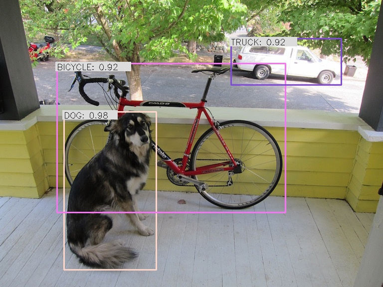

Get nvidia-pyindex to get access to the tritonclient packages:

```bash
pip install --user nvidia-pyindex
```

Create new conda environment:

```
conda env create -f environment.yml
conda activate yolov4-triton
```

Make sure triton server is running. Run the client:

```bash
python client.py image data/dog.jpg

Running in 'image' mode
Creating buffer from image file...
Invoking inference...
Done
Received result buffer of size (1, 7001, 1, 1)
Naive buffer sum: 239916.53125
Raw boxes: 46
Detected objects: 3
DOG: 0.9788089394569397
BICYCLE: 0.9222095012664795
TRUCK: 0.9168747067451477
```




Full features of this client:

```
usage: client.py [-h] [-m MODEL] [-u URL] [-o OUT] [-c CONFIDENCE] [-n NMS]
                 [-f FPS] [-i] [-v] [-t CLIENT_TIMEOUT] [-s]
                 [-r ROOT_CERTIFICATES] [-p PRIVATE_KEY]
                 [-x CERTIFICATE_CHAIN]
                 {dummy,image,video} [input]

positional arguments:
  {dummy,image,video}   Run mode. 'dummy' will send an emtpy buffer to the
                        server to test if inference works. 'image' will
                        process an image. 'video' will process a video.
  input                 Input file to load from in image or video mode

optional arguments:
  -h, --help            show this help message and exit
  -m MODEL, --model MODEL
                        Inference model name, default yolov4
  -u URL, --url URL     Inference server URL, default localhost:8001
  -o OUT, --out OUT     Write output into file instead of displaying it
  -c CONFIDENCE, --confidence CONFIDENCE
                        Confidence threshold for detected objects, default 0.8
  -n NMS, --nms NMS     Non-maximum suppression threshold for filtering raw
                        boxes, default 0.5
  -f FPS, --fps FPS     Video output fps, default 24.0 FPS
  -i, --model-info      Print model status, configuration and statistics
  -v, --verbose         Enable verbose client output
  -t CLIENT_TIMEOUT, --client-timeout CLIENT_TIMEOUT
                        Client timeout in seconds, default no timeout
  -s, --ssl             Enable SSL encrypted channel to the server
  -r ROOT_CERTIFICATES, --root-certificates ROOT_CERTIFICATES
                        File holding PEM-encoded root certificates, default
                        none
  -p PRIVATE_KEY, --private-key PRIVATE_KEY
                        File holding PEM-encoded private key, default is none
  -x CERTIFICATE_CHAIN, --certificate-chain CERTIFICATE_CHAIN
                        File holding PEM-encoded certicate chain default is
                        none
```
